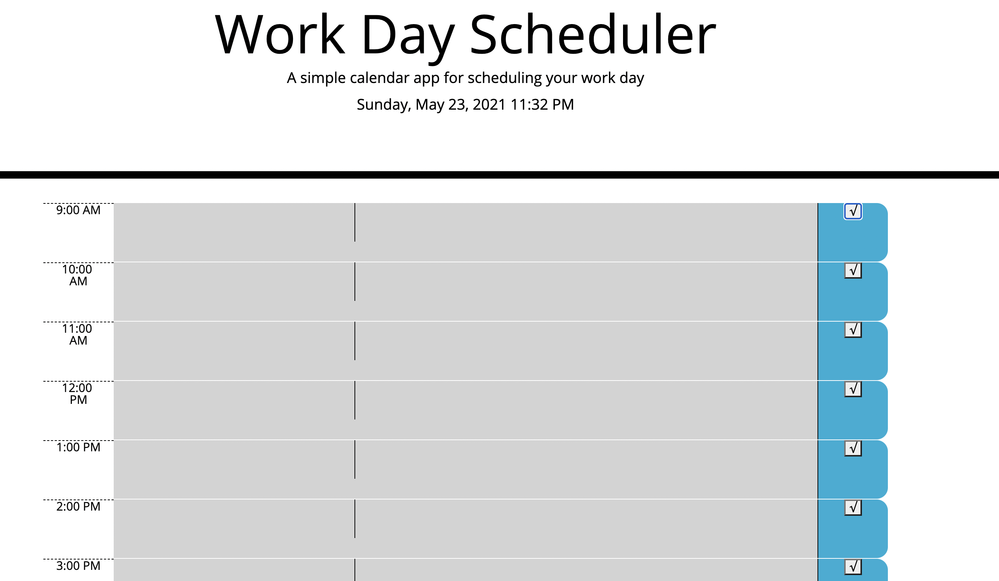

# Work Day Scheduler Starter Code

## Description 
This task-organizer app is designed to store data within an hourly schedule grid, providing color coordination for the user based upon which hours have already past, the current hour, and which hours are left in the day.
- this App only offers a business hour schedule to work with  (9am-5pm) as requested by the client. 

## Purpose
The purpose of this application is to assist the user in daily planning operations, by storing data in an organized hour-to-hour format.

## Built With 
HTML CSS JavaScript BootStrap jQuery Moment.js

## Snapshots of Application 

## Website 

https://twalker7.github.io/05-calendarPro/

## Contribution
The starter code of this project was provided by UCLA Extension Coding Bootcamp (The majority of the CSS and HTML files). All of the Javscript file was developed by Thomas Walker. 